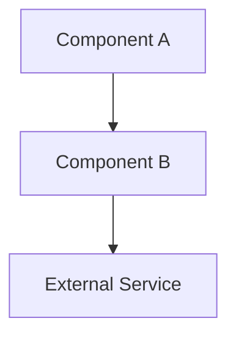
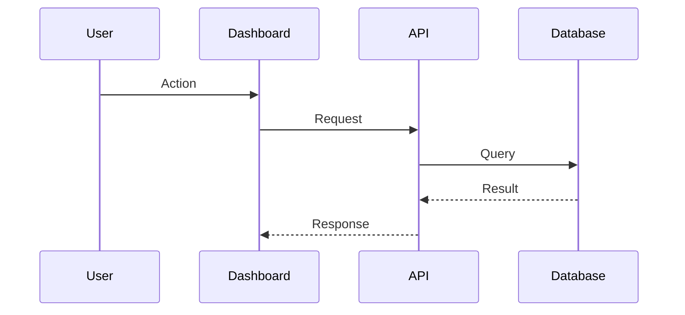

# Document Skill

You are managing documentation for {{PROJECT_NAME}}. The user invoked `/document $ARGUMENTS`.

## Determine Mode

Parse arguments:

| Argument | Mode | Action |
|----------|------|--------|
| `research [topic]` | Research | Create a research document with options analysis |
| `design [feature]` | Design | Create a design document with architecture and decisions |
| `architecture` | Architecture | Generate/update system architecture overview from code |
| `audit` | Audit | Scan all docs for staleness against actual code |
| `runbook [operation]` | Runbook | Create an operational runbook with steps and rollback |
| `update [file]` | Update | Refresh an existing document against current code |
| `review [file]` | Review | Review a document for completeness, accuracy, and clarity |

## Mode: Research (`/document research API authentication`)

Create a research document for evaluating options before making a technical decision.

### Step 1: Gather Context

1. Search the codebase for existing related code:
   ```
   grep -rn "[topic keywords]" --include="*.ts" src/ lib/ dashboard/
   ```
2. Check for existing docs on the topic:
   ```
   find docs/ -name "*.md" | xargs grep -li "[topic]"
   ```
3. Read any existing implementation to understand current state

### Step 2: Research Structure

Write to `docs/research/[TOPIC_SLUG].md`:

```markdown
# Research: [Topic Title]

**Date:** [today]
**Author:** [human + Claude Code]
**Status:** Draft | Under Review | Accepted | Superseded by [link]
**Decision:** [one-line summary of recommendation — filled after review]

## Context

[Why this research is needed. What problem are we solving? What triggered this investigation?]

## Current State

[What exists today. Code references with file:line. What works, what doesn't.]

## Requirements

- [Must-have requirement 1]
- [Must-have requirement 2]
- [Nice-to-have requirement 1]

## Options Evaluated

### Option A: [Name]

**How it works:** [Technical description]

**Pros:**
- [Advantage 1]
- [Advantage 2]

**Cons:**
- [Disadvantage 1]
- [Disadvantage 2]

**Effort:** [Small | Medium | Large]
**Risk:** [Low | Medium | High]

**Example:**
```typescript
// Code sketch showing how this would look in our codebase
```

### Option B: [Name]
[Same structure as Option A]

### Option C: [Name]
[Same structure as Option A]

## Comparison Matrix

| Criteria | Option A | Option B | Option C |
|----------|----------|----------|----------|
| Effort | S / M / L | S / M / L | S / M / L |
| Risk | Low / Med / High | ... | ... |
| Maintenance | ... | ... | ... |
| [Requirement 1] | ✓ / ✗ / Partial | ... | ... |
| [Requirement 2] | ✓ / ✗ / Partial | ... | ... |

## Recommendation

**Option [X]** because:
1. [Primary reason — ties to requirements]
2. [Secondary reason — ties to project constraints]
3. [Risk mitigation — how cons are addressed]

## Implementation Sketch

[High-level steps to implement the recommendation. File paths, module boundaries, migration steps if applicable.]

## Open Questions

- [ ] [Question that needs human input or further research]
- [ ] [Question that affects the recommendation]

## References

- [External docs, RFCs, blog posts consulted]
- [Internal docs referenced]
```

### Step 3: Validate

- Every claim about the codebase must reference actual file:line
- Options must be genuinely different (not straw men)
- Recommendation must be justified by the requirements, not personal preference
- If you don't have enough information for a recommendation, say so explicitly

## Mode: Design (`/document design fleet identity profiles`)

Create a design document for a feature before implementation.

### Step 1: Gather Context

1. Read related existing code to understand the current system
2. Read `docs/guides/API_DESIGN.md` for API conventions
3. Read `docs/guides/SECURITY.md` for auth requirements
4. Check KANBAN.md for related backlog items
5. Check for existing design docs: `find docs/ -name "*.md" | xargs grep -li "[feature]"`

### Step 2: Design Structure

Write to `docs/design/[FEATURE_SLUG].md`:

```markdown
# Design: [Feature Title]

**Date:** [today]
**Author:** [human + Claude Code]
**Status:** Draft | Under Review | Approved | Implemented | Deprecated
**Sprint:** [target sprint, if known]
**Specialist:** [from SQUAD_PLANNING.md — who implements this]

## Problem Statement

[What user/system problem does this solve? One paragraph, no jargon.]

## Goals

- [Goal 1 — measurable outcome]
- [Goal 2]

## Non-Goals

- [Explicitly out of scope item 1]
- [Explicitly out of scope item 2]

## Architecture

### System Context

[How this feature fits into the existing system. Which modules it touches.]

```
[Mermaid diagram or text description of component relationships]
```

### Data Model

[New or modified data structures]

```typescript
interface NewEntity {
	id: string;
	// ... fields with types and descriptions
}
```

**Storage:** [Where this data lives — Firestore collection, file system, etc.]
**Indexes:** [Any new indexes needed]

### API Surface

[New or modified endpoints]

| Method | Path | Auth | Description |
|--------|------|------|-------------|
| GET | `/api/[resource]` | Required | List resources |
| POST | `/api/[resource]` | Admin | Create resource |

**Request/response examples** for each endpoint.

### Module Design

| Module | Responsibility | New/Modified |
|--------|---------------|-------------|
| `lib/[module].ts` | Business logic | New |
| `dashboard/app/api/[route]/route.ts` | HTTP handler | New |
| `dashboard/lib/[helper].ts` | Shared utilities | Modified |

### Security Considerations

- [Auth: who can access what]
- [Input validation: what's validated where]
- [Data protection: encryption, hashing, access control]

### Error Handling

| Error Case | Handling | User Experience |
|-----------|----------|----------------|
| [Error 1] | [How it's caught and handled] | [What the user sees] |
| [Error 2] | ... | ... |

## Alternatives Considered

### [Alternative approach]
[Why it was rejected — 1-2 sentences]

## Migration / Rollout

- [ ] [Step 1 — e.g., database migration]
- [ ] [Step 2 — e.g., deploy backend first]
- [ ] [Step 3 — e.g., enable feature flag]
- [ ] [Step 4 — e.g., deploy frontend]

**Rollback plan:** [How to undo if something goes wrong]

## Test Plan

- Unit tests: `test/[module].test.ts` — [what to test]
- Integration tests: `test/live/[feature].test.ts` — [what to test]
- Manual verification: [steps to verify in staging]

## Open Questions

- [ ] [Design decision that needs input]

## Decision Log

| Date | Decision | Rationale |
|------|----------|-----------|
| [date] | [what was decided] | [why] |
```

### Step 3: Cross-Reference

- Verify all referenced modules actually exist (or note them as "to be created")
- Verify API design follows conventions in `docs/guides/API_DESIGN.md`
- Verify security approach follows `docs/guides/SECURITY.md`
- Link to related research docs if they exist

## Mode: Architecture (`/document architecture`)

Generate or update the system architecture overview from the actual codebase.

### Step 1: Scan the Codebase

1. **Map the directory structure:**
   ```
   find src/ lib/ dashboard/ -type f -name "*.ts" -o -name "*.tsx" | head -100
   ```

2. **Identify entry points:**
   ```
   grep -rn "createServer\|app.listen\|export default\|NextConfig" --include="*.ts" --include="*.mjs" .
   ```

3. **Map module dependencies:**
   ```
   grep -rn "^import.*from" --include="*.ts" src/ lib/ dashboard/lib/
   ```

4. **Identify external integrations:**
   ```
   grep -rn "fetch(\|new.*Client\|createClient\|@google-cloud" --include="*.ts" src/ lib/
   ```

5. **Read existing architecture docs** (if any):
   ```
   find docs/ -name "*architect*" -o -name "*overview*" -o -name "*system*"
   ```

### Step 2: Architecture Document Structure

Write to `docs/architecture/SYSTEM_OVERVIEW.md`:

```markdown
# System Architecture — {{PROJECT_NAME}}

**Last updated:** [today]
**Updated by:** Claude Code /document architecture
**Code hash:** [short git SHA at time of generation]

## System Overview

[One paragraph — what the system does, who uses it, key technical choices]

## Component Diagram



## Components

### [Component 1: e.g., Dashboard]
- **Tech:** [e.g., Next.js 14, App Router]
- **Location:** `dashboard/`
- **Responsibility:** [What it does]
- **Entry point:** `dashboard/app/layout.tsx`
- **Key modules:**
  - `dashboard/lib/authorization.ts` — RBAC checks
  - `dashboard/lib/[module].ts` — [description]

### [Component 2: e.g., Collector]
[Same structure]

### [Component 3: e.g., CLI]
[Same structure]

## Data Flow



## Data Storage

| Store | Technology | What's stored | Access pattern |
|-------|-----------|---------------|----------------|
| [e.g., Firestore] | [type] | [entities] | [read-heavy / write-heavy / balanced] |

## External Integrations

| Service | Purpose | Module | Fallback |
|---------|---------|--------|----------|
| [e.g., Typesense] | Full-text search | `lib/typesense/` | Firestore client-side filtering |

## Authentication & Authorization

[How auth works — session flow, token flow, RBAC model]

## Infrastructure

| Environment | URL | Platform | Notes |
|------------|-----|----------|-------|
| Local | `localhost:3000` | Node.js | `bin/local-stack.sh start` |
| Staging | [URL] | [e.g., Cloud Run] | Auto-deploy from CI |
| Production | [URL] | [e.g., Cloud Run] | Manual deploy |

## Key Design Decisions

| Decision | Choice | Rationale | Date |
|----------|--------|-----------|------|
| [e.g., Test runner] | Node.js built-in | No extra deps, fast, built-in assertions | Sprint 1 |
| [e.g., Auth model] | Dual (cookies + tokens) | Cookies for dashboard, tokens for API/CLI | Sprint 11 |

## Module Dependency Map

[Generated from actual imports — shows which modules depend on which]
```

### Step 3: Verify

- Every component listed must correspond to actual directories/files
- Every external integration must have a code reference
- Diagrams must reflect actual data flow (verify by reading route handlers)
- If existing architecture doc exists, diff against it and highlight what changed

## Mode: Audit (`/document audit`)

Scan all documentation for staleness against the actual codebase.

### Step 1: Inventory

List all documentation files:
```
find docs/ -name "*.md" -not -path "*/sprints/*" | sort
```

Also check:
- `README.md`
- `CLAUDE.md`
- `.claude/MEMORY.md`
- `docs/process/PROJECT_CONTEXT.md`

### Step 2: For Each Document

1. **Read the document**
2. **Extract verifiable claims** — file paths, function names, API endpoints, env vars, commands
3. **Verify each claim against the codebase:**
   - File paths: does the file exist?
   - Function names: does the function exist in that file?
   - API endpoints: does the route handler exist?
   - Env vars: are they referenced in code?
   - Commands: do the scripts exist?
   - Version numbers: are they current?

4. **Check for missing coverage:**
   - Are there modules with no documentation?
   - Are there API endpoints not mentioned in any doc?
   - Are there env vars not documented?

### Step 3: Staleness Report

```markdown
# Documentation Audit Report

**Date:** [today]
**Documents scanned:** N
**Findings:** N stale, N missing, N current

---

## Stale Documents

### DOC-001: [file path]
- **Last meaningful update:** [estimate from git log]
- **Stale claims:**
  - Line N: references `src/old-file.ts` — file no longer exists
  - Line N: says "3 API endpoints" — there are now 7
  - Line N: env var `OLD_VAR` — renamed to `NEW_VAR`
- **Suggested action:** Update lines N, N, N to reflect current code

---

## Missing Documentation

### DOC-M01: [module/feature with no docs]
- **Location:** `src/[module]/`
- **Exports:** N functions, N types
- **Used by:** [list of importers]
- **Suggested doc:** [research | design | architecture section | guide update]

---

## Current Documents (no issues found)

- [x] `docs/guides/SECURITY.md` — all claims verified
- [x] `docs/guides/TESTING.md` — all claims verified
- [x] ...

---

## Recommendations

1. [Highest priority — most-read doc with most stale claims]
2. [Next priority]
3. ...

## Maintenance Schedule

Based on change frequency:
- **Monthly review:** [docs that reference fast-changing code]
- **Sprint review:** [docs updated during sprint-end checklist]
- **Quarterly review:** [stable guides and process docs]
```

## Mode: Runbook (`/document runbook database migration`)

Create an operational runbook for a repeatable procedure.

### Step 1: Gather Context

1. Search for related scripts:
   ```
   find bin/ -name "*[operation]*"
   ```
2. Check existing runbooks:
   ```
   find docs/ -name "*runbook*" -o -name "*procedure*" -o -name "*playbook*"
   ```
3. Read related deployment/infrastructure docs

### Step 2: Runbook Structure

Write to `docs/runbooks/[OPERATION_SLUG].md`:

```markdown
# Runbook: [Operation Title]

**Last tested:** [date]
**Tested by:** [who]
**Estimated duration:** [time]
**Risk level:** Low | Medium | High
**Requires:** [permissions, access, tools needed]

## When to Use

[Describe the trigger — when should someone execute this runbook]

## Prerequisites

- [ ] [Required access / permissions]
- [ ] [Required tools installed]
- [ ] [Required env vars set]
- [ ] [Required state — e.g., "staging deploy is current"]

## Pre-flight Checks

```bash
# Verify you're in the right context
[commands to verify state]
```

Expected output: [what you should see if everything is ready]

## Procedure

### Step 1: [Action]

```bash
[exact command to run]
```

**Expected output:**
```
[what success looks like]
```

**If it fails:** [what to do — specific error handling]

### Step 2: [Action]
[Same structure]

### Step 3: [Verification]

```bash
[commands to verify the operation succeeded]
```

**Success criteria:**
- [ ] [Verifiable outcome 1]
- [ ] [Verifiable outcome 2]

## Rollback

If something goes wrong at any step:

### From Step 1:
```bash
[rollback command]
```

### From Step 2:
```bash
[rollback command]
```

## Post-Operation

- [ ] [Notify team / update status page]
- [ ] [Update monitoring / alerts]
- [ ] [Log the operation — when, who, outcome]

## Troubleshooting

| Symptom | Cause | Fix |
|---------|-------|-----|
| [Error message] | [Why it happens] | [How to fix] |
| [Unexpected state] | [Why it happens] | [How to fix] |

## History

| Date | Operator | Outcome | Notes |
|------|----------|---------|-------|
| [date] | [who] | Success / Partial / Failed | [any notes] |
```

### Step 3: Validate

- Every command must be copy-pasteable (no placeholders without explanation)
- Every step must have a verification method
- Rollback must be possible from every step
- Prerequisites must be checkable (not "make sure everything is ready")

## Mode: Update (`/document update docs/guides/SECURITY.md`)

Refresh an existing document against current code.

1. **Read the document** completely
2. **Extract all verifiable claims** (file paths, functions, endpoints, env vars, commands)
3. **Verify each claim** against the codebase
4. **For stale claims:**
   - Show the user what's wrong: "Line 45 references `src/auth.ts` but the file is now `lib/auth/index.ts`"
   - Suggest the correction
   - Ask user to confirm before editing
5. **For missing coverage:**
   - Identify new modules/features not mentioned in the doc
   - Suggest additions with draft content
6. **Update the "Last updated" date** if changes are made

## Mode: Review (`/document review docs/design/fleet-profiles.md`)

Review a document for completeness, accuracy, and readiness for external review.

### Review Checklist

**Structure:**
- [ ] Has clear title and metadata (date, author, status)
- [ ] Has a problem statement or purpose section
- [ ] Sections flow logically (context → design → implementation → verification)
- [ ] No orphaned sections (referenced but missing, or present but unreferenced)

**Accuracy:**
- [ ] All file paths reference real files
- [ ] All function/type names match the code
- [ ] All API endpoints match route handlers
- [ ] All env vars are documented correctly
- [ ] Commands are copy-pasteable and work
- [ ] Version numbers are current

**Completeness:**
- [ ] Covers all relevant modules for the topic
- [ ] Error cases and edge cases addressed
- [ ] Security considerations included (if applicable)
- [ ] Migration/rollback plan included (if applicable)
- [ ] Open questions are listed (not hidden)

**Clarity:**
- [ ] Readable by someone unfamiliar with the codebase
- [ ] Jargon is defined or avoided
- [ ] Diagrams used where text is insufficient
- [ ] Examples provided for complex concepts
- [ ] Decision rationale is explicit (not just "we chose X")

**External Review Readiness:**
- [ ] No internal shorthand or unexplained acronyms
- [ ] No assumptions about reader's context
- [ ] Self-contained (doesn't require reading 5 other docs first)
- [ ] Table of contents for documents > 200 lines
- [ ] References and links are valid

### Review Report

```markdown
## Document Review — [file path]

**Reviewer:** Claude Code /document review
**Date:** [today]

### Score: [A | B | C | D]

| Category | Score | Notes |
|----------|-------|-------|
| Structure | ✓ / ⚠ / ✗ | [brief note] |
| Accuracy | ✓ / ⚠ / ✗ | [brief note] |
| Completeness | ✓ / ⚠ / ✗ | [brief note] |
| Clarity | ✓ / ⚠ / ✗ | [brief note] |
| External Readiness | ✓ / ⚠ / ✗ | [brief note] |

### Issues Found

1. **[Category]** Line N — [issue description]
   Fix: [suggestion]

2. ...

### Strengths

- [What's done well]

### Suggestions

- [Improvement that would raise the document quality]
```

## Document Naming Conventions

| Type | Location | Naming |
|------|----------|--------|
| Research | `docs/research/` | `TOPIC_SLUG.md` (e.g., `API_AUTH_BEST_PRACTICES.md`) |
| Design | `docs/design/` | `FEATURE_SLUG.md` (e.g., `FLEET_IDENTITY_PROFILES.md`) |
| Architecture | `docs/architecture/` | `SYSTEM_OVERVIEW.md`, `COMPONENT_NAME.md` |
| Runbook | `docs/runbooks/` | `OPERATION_SLUG.md` (e.g., `DATABASE_MIGRATION.md`) |
| Guide | `docs/guides/` | `TOPIC.md` (e.g., `SECURITY.md`) |
| Sprint handover | `docs/sprints/` | `SPRINT{N}_HANDOVER.md` |

## Important Rules

- **Always verify claims against code** — never write documentation from memory or assumptions
- **Include file:line references** — docs without code references go stale fastest
- **Date everything** — every document needs a creation date and last-updated date
- **Status is mandatory** — Draft / Under Review / Accepted / Implemented / Deprecated / Superseded
- **Prefer Mermaid diagrams** over ASCII art — they render in GitHub and are easier to maintain
- **Link related docs** — if a design doc references a research doc, link it
- **Keep documents self-contained** — a reader shouldn't need to read 5 other docs to understand one
- **Audit regularly** — stale docs are worse than no docs. Use `/document audit` at sprint end
- **Reference `docs/guides/DOCUMENTATION.md`** for project documentation standards
