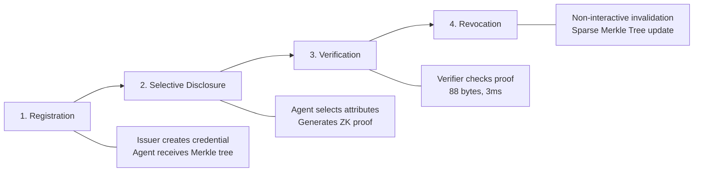
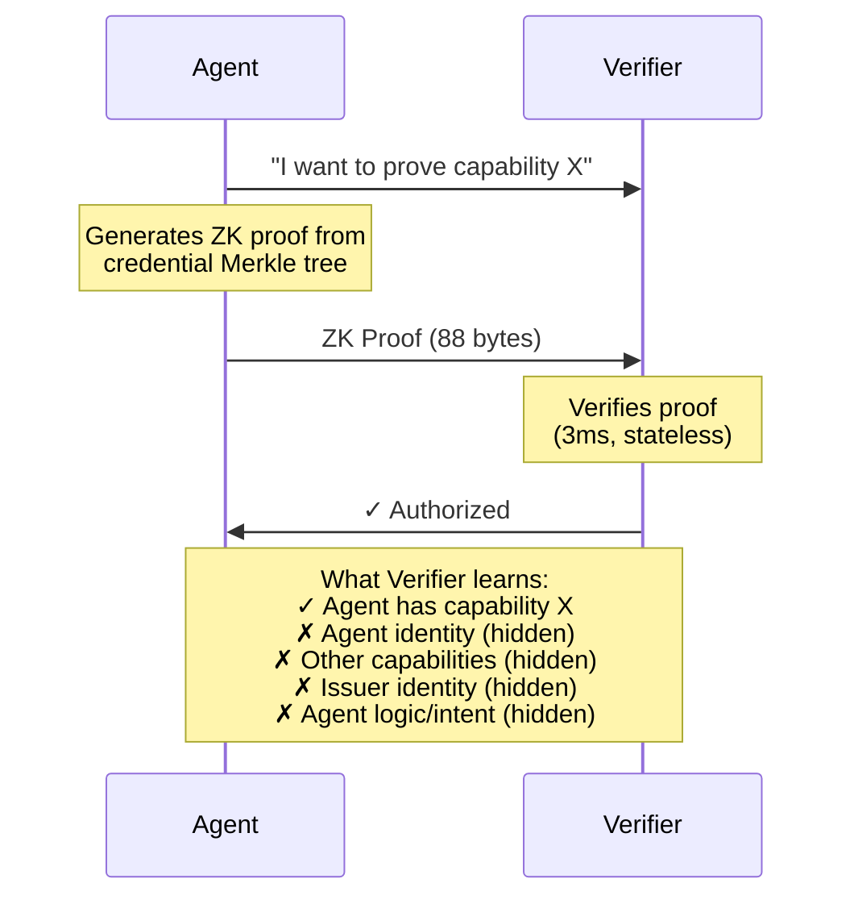
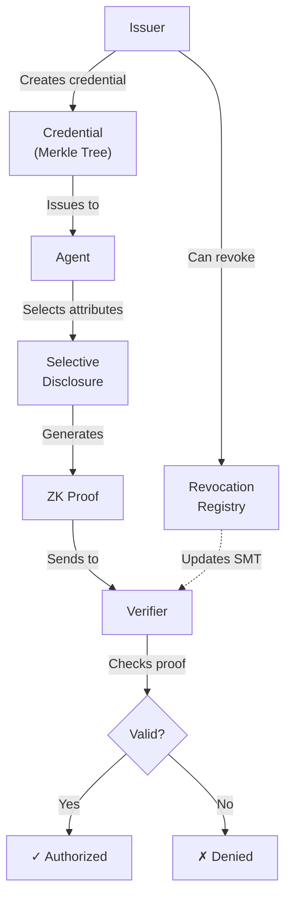

# Whitepaper Web Diagrams

All diagrams below should be rendered inline on the whitepaper web pages. Each diagram has a light and dark variant spec.

---

## Diagram 1: CAPTHCA Protocol Overview (4-Phase Flow)

Placement: After "What's Inside" / "SPECIFICATION INDEX" section



Design notes:
- Render as a horizontal pipeline with 4 large numbered nodes
- Each node has an icon: key (Registration), eye-slash (Disclosure), check-shield (Verification), rotate (Revocation)
- Below each node, a brief description
- Light: nodes are white cards with blue (#0288D1) borders and gold (#FFD700) numbers
- Dark: nodes are dark cards (#0a0a0a) with green (#39FF14) borders and red (#ff003c) numbers
- Connecting arrows should be animated on scroll (draw-in effect)

---

## Diagram 2: Zero-Knowledge Handshake (Sequence Diagram)

Placement: After Diagram 1, in a "How Verification Works" subsection



Design notes:
- Two-column sequence diagram with clear "REVEALED" vs "HIDDEN" callout
- Light: Agent column blue, Verifier column gold, hidden items in gray
- Dark: Agent column green, Verifier column red, hidden items struck through
- The "What Verifier learns" box is the key visual — make it prominent

---

## Diagram 3: Credential Lifecycle

Placement: New section between "Key Findings" and "Download" sections



Design notes:
- Vertical flow diagram showing the full credential journey
- Issuer at top, Agent in middle, Verifier at bottom
- Revocation branch comes off to the side
- Light: soft rounded cards, blue flow arrows, gold for the Issuer
- Dark: angular cards with glow effects, green flow arrows, red for Revocation

---

## Diagram 4: Sparse Merkle Tree Structure

Placement: Inside "Key Findings" section, after "Cryptographic Proof > Biological Proof"

```
                    Root Hash
                   /         \
              H(L)             H(R)
             /    \           /    \
        Identity  Capabilities  Metadata  [empty]
        /    \      /    \
    name   org  role  clearance
    (hidden) (hidden) (REVEALED) (hidden)
```

Design notes:
- Interactive tree where hovering a node shows its status (revealed/hidden)
- Revealed nodes glow (blue for light track, green for dark track)
- Hidden nodes are dimmed/grayed out
- A subtle animation "highlights" the path from root to the revealed attribute
- Light: clean lines, soft shadows, blue accent on revealed path
- Dark: glowing edges, green accent on revealed path, CRT-style node labels

---

## Diagram 5: CAPTCHA Evolution Timeline

Placement: New section "The Evolution" before "Key Findings"

Timeline data:
```json
[
  { "year": 2003, "event": "CAPTCHA coined", "detail": "Carnegie Mellon researchers name the concept", "type": "milestone" },
  { "year": 2007, "event": "reCAPTCHA", "detail": "Digitizing books while verifying humans", "type": "milestone" },
  { "year": 2009, "event": "Google acquires reCAPTCHA", "detail": "Scale to billions of verifications", "type": "milestone" },
  { "year": 2014, "event": "No CAPTCHA reCAPTCHA", "detail": "Behavioral analysis replaces puzzles", "type": "evolution" },
  { "year": 2018, "event": "reCAPTCHA v3", "detail": "Invisible scoring — no user interaction", "type": "evolution" },
  { "year": 2022, "event": "Cloudflare Turnstile", "detail": "Private, non-interactive alternative", "type": "evolution" },
  { "year": 2025, "event": "Private Access Tokens", "detail": "Apple/Cloudflare device attestation", "type": "evolution" },
  { "year": 2026, "event": "CAPTHCA", "detail": "Cryptographic agent authorization", "type": "breakthrough" }
]
```

Design notes:
- Horizontal scrollable timeline
- Each milestone is a node on the line with year above and event below
- CAPTHCA (2026) node is larger and highlighted as the "breakthrough"
- Light: gold timeline line, blue nodes, CAPTHCA node in gold with glow
- Dark: green timeline line (Matrix-style), red CAPTHCA node with pulse animation
- Mobile: vertical timeline

---

## Chart 1: Breach Cause Breakdown (Donut Chart)

Placement: Inside "Key Findings" → "The Human Vulnerability"

```json
{
  "type": "donut",
  "data": [
    { "name": "Human Element", "value": 68, "color_light": "#0288D1", "color_dark": "#39FF14" },
    { "name": "System Vulnerabilities", "value": 13, "color_light": "#FFD700", "color_dark": "#ff003c" },
    { "name": "Malware", "value": 10, "color_light": "#90CAF9", "color_dark": "#00FF41" },
    { "name": "Credential Theft", "value": 6, "color_light": "#B0BEC5", "color_dark": "#666666" },
    { "name": "Other", "value": 3, "color_light": "#CFD8DC", "color_dark": "#333333" }
  ],
  "centerLabel": "68%",
  "centerSubtitle": "Human Element",
  "source": "Verizon DBIR 2024"
}
```

Design notes:
- Large donut chart with the "68%" stat in the center
- On hover, each segment expands slightly and shows its label
- Light: clean pastels with blue dominant
- Dark: neon glow on segments, dark bg, green dominant

---

## Chart 2: AI Phishing Effectiveness (Bar Chart)

Placement: Inside "Key Findings" → "The Human Vulnerability" (below donut)

```json
{
  "type": "bar",
  "data": [
    { "name": "AI-Generated Phishing", "value": 54, "unit": "%" },
    { "name": "Human-Written Phishing", "value": 12, "unit": "%" }
  ],
  "ylabel": "Click-Through Rate",
  "source": "IBM X-Force 2024"
}
```

Design notes:
- Simple two-bar comparison — dramatic 54% vs 12%
- Light: blue bars with gold accent on the 54% bar
- Dark: green bars, 54% bar has a red warning glow
- Include a "4.5x more effective" callout annotation between bars

---

## Chart 3: Confidential Computing Market (Area Chart)

Placement: Inside "Key Findings" → "The Confidential Computing Inflection"

```json
{
  "type": "area",
  "data": [
    { "year": 2022, "value": 12 },
    { "year": 2023, "value": 17 },
    { "year": 2024, "value": 24 },
    { "year": 2025, "value": 42 },
    { "year": 2026, "value": 72 },
    { "year": 2027, "value": 120 },
    { "year": 2028, "value": 195 },
    { "year": 2029, "value": 310 },
    { "year": 2030, "value": 464 }
  ],
  "ylabel": "Market Size ($B)",
  "annotation": { "year": 2026, "label": "CAPTHCA Launch" },
  "source": "Gartner 2024"
}
```

Design notes:
- Smooth area chart showing exponential growth curve
- A vertical dashed line at 2026 marks "CAPTHCA Launch"
- Light: blue gradient fill, gold annotation marker
- Dark: green gradient fill (dark to bright), red annotation marker
- Include "$24B → $464B" and "1,835% growth" callout

---

## Chart 4: Agent Adoption vs Governance Gap (Stacked Bar)

Placement: Inside "Key Findings" → "AI Agent Proliferation Requires New Governance"

```json
{
  "type": "stackedBar",
  "data": [
    {
      "category": "Fortune 500",
      "segments": [
        { "name": "Deploy AI Agents", "value": 80, "color_light": "#0288D1", "color_dark": "#39FF14" },
        { "name": "No AI Agents", "value": 20, "color_light": "#E0E0E0", "color_dark": "#333333" }
      ]
    },
    {
      "category": "Governance",
      "segments": [
        { "name": "Have Governance", "value": 21, "color_light": "#FFD700", "color_dark": "#ff003c" },
        { "name": "No Governance", "value": 79, "color_light": "#E0E0E0", "color_dark": "#333333" }
      ]
    }
  ],
  "annotation": "59% governance gap",
  "source": "McKinsey 2024"
}
```

Design notes:
- Two horizontal stacked bars side by side
- A dramatic "59% GOVERNANCE GAP" arrow annotation between them
- Light: clean corporate style, blue and gold
- Dark: warning-style, green and red with pulsing gap indicator

---

## Diagram 6: Proof System Comparison Matrix

Placement: Inside "What's Inside" expanded view or as a new "Technical Overview" section

```json
{
  "type": "comparisonTable",
  "headers": ["Property", "Groth16", "PLONK", "zk-STARKs"],
  "rows": [
    ["Proof Size", "88 bytes", "~400 bytes", "~50 KB"],
    ["Verification Time", "3ms", "5ms", "50ms"],
    ["Trusted Setup", "Per-circuit", "Universal", "None"],
    ["Post-Quantum", "No", "No", "Yes"],
    ["Used in CAPTHCA", "Primary", "Fallback", "Future"]
  ],
  "highlight_column": "Groth16"
}
```

Design notes:
- Styled table with Groth16 column highlighted (it's what CAPTHCA uses)
- Light: white table with blue header row, gold highlight on Groth16 column
- Dark: dark table with green header, Groth16 column has green left border
- "Used in CAPTHCA" row should have a checkmark icon for Groth16

---

## Diagram 7: Before/After Identity Comparison

Placement: After the protocol overview diagram

Two-column comparison:

```json
{
  "type": "comparison",
  "before": {
    "title": "Legacy Identity",
    "items": [
      { "icon": "key", "label": "Passwords", "status": "vulnerable", "note": "81% of breaches" },
      { "icon": "fingerprint", "label": "Biometrics", "status": "fragile", "note": "Irrevocable if compromised" },
      { "icon": "puzzle", "label": "CAPTCHAs", "status": "obsolete", "note": "AI solves 100%" },
      { "icon": "id-card", "label": "KYC/Identity Docs", "status": "privacy-invasive", "note": "Full disclosure required" }
    ]
  },
  "after": {
    "title": "CAPTHCA",
    "items": [
      { "icon": "shield-check", "label": "ZK Credentials", "status": "secure", "note": "88 bytes, 3ms" },
      { "icon": "eye-off", "label": "Selective Disclosure", "status": "private", "note": "Reveal only what's needed" },
      { "icon": "bot", "label": "Agent-Native", "status": "future-proof", "note": "Human + machine + hybrid" },
      { "icon": "rotate-ccw", "label": "Revocable", "status": "manageable", "note": "Non-interactive invalidation" }
    ]
  }
}
```

Design notes:
- Side-by-side with a divider line
- Left side (Before) has red/warning styling, items have strikethrough or X marks
- Right side (After) has green/success styling, items have checkmarks
- Light: soft card style, red-to-blue gradient divider
- Dark: terminal style, items typed out like console output
- Mobile: stacked vertically

---

## Diagram 8: Key Stats Dashboard

Placement: Right after the hero/intro section on both tracks

```json
{
  "type": "statsDashboard",
  "stats": [
    { "value": "88", "unit": "bytes", "label": "Proof Size", "icon": "minimize" },
    { "value": "3", "unit": "ms", "label": "Verification Time", "icon": "zap" },
    { "value": "80×", "unit": "", "label": "Faster than SHA-256", "icon": "trending-up" },
    { "value": "0", "unit": "", "label": "Identity Revealed", "icon": "eye-off" }
  ]
}
```

Design notes:
- 4-stat horizontal card row (responsive: 2x2 on mobile)
- Each stat has a large number, small unit, label below, icon
- Light: white cards with subtle shadow, blue numbers, gold icons
- Dark: dark glass cards, green numbers with glow, stats animate counting up on scroll
- Consider CountUp animation when scrolling into view

---

## Diagram 9: Roadmap Timeline

Placement: New "Roadmap" section before the download/CTA

```json
{
  "type": "roadmap",
  "phases": [
    { "phase": 1, "title": "Protocol Specification", "status": "complete", "date": "Q1 2026", "items": ["Whitepaper publication", "Cryptographic proofs formalized", "Peer review initiated"] },
    { "phase": 2, "title": "Reference Implementation", "status": "in-progress", "date": "Q2 2026", "items": ["Rust library (circom + arkworks)", "TypeScript SDK", "Developer documentation"] },
    { "phase": 3, "title": "Testnet", "status": "upcoming", "date": "Q3 2026", "items": ["Public testnet launch", "Bug bounty program", "Integration partners onboarded"] },
    { "phase": 4, "title": "Mainnet", "status": "planned", "date": "Q1 2027", "items": ["Production deployment", "Enterprise pilot programs", "Audit completion"] },
    { "phase": 5, "title": "Ecosystem", "status": "planned", "date": "Q3 2027", "items": ["Cross-chain bridges", "Governance DAO", "Global credential federation"] }
  ]
}
```

Design notes:
- Horizontal timeline (vertical on mobile)
- Completed phases have filled nodes, in-progress has animated pulse, upcoming are outlined
- Light: gold completed nodes, blue in-progress, gray upcoming
- Dark: green completed, red in-progress with pulse, dim gray upcoming
- Each phase expands on hover/click to show items list

---

## Additional Visual Elements

### Animated Counter Stats
For the Key Findings section, all numerical values should use a CountUp animation when they scroll into view:
- "68%" counts up from 0 over 1.5s
- "88 bytes" counts from 0
- "3ms" counts from 0
- "$464B" counts from $24B
- "80x" counts up from 1x

### Pull Quote Styling
Key quotes from the whitepaper should be rendered as pull quotes:
- Light: serif italic font, gold left border (4px), light blue background
- Dark: monospace, green left border (4px), dark terminal background with scanlines

### Section Dividers
Between major sections:
- Light: thin gold line with a small CAPTHCA hexagon icon centered
- Dark: glitching green horizontal line with "// SECTION BREAK" in small mono text
