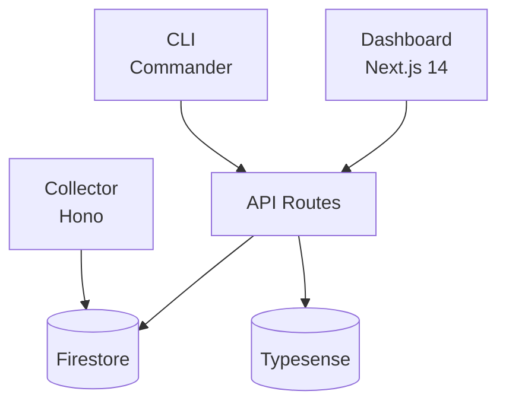

# Documentation Guide

Standards and practices for creating, maintaining, and reviewing documentation in CAPTHCA land. Good documentation enables external reviews, accelerates onboarding, and preserves decisions across sprints.

## Why Documentation Matters

Documentation serves three audiences:

1. **Future you** — context recovery after days/weeks away from the code
2. **Team members** — human or AI agents joining the project mid-stream
3. **External reviewers** — auditors, consultants, or stakeholders who need to understand the system without reading every line of code

Stale documentation is **worse than no documentation** — it actively misleads. The practices below are designed to keep docs accurate with minimal overhead.

## Document Types

### Research Documents

**Purpose:** Evaluate options before making a technical decision.
**When:** Before building anything with multiple valid approaches.
**Location:** `docs/research/`
**Lifecycle:** Draft → Under Review → Accepted → (optionally) Superseded

A research document answers: "We considered A, B, and C. We chose B because..."

**Must include:**
- Context (why this research was needed)
- At least 2 genuine options (not straw men)
- Comparison matrix with concrete criteria
- Recommendation with explicit rationale
- Code references to current state

**Examples of good research triggers:**
- "Should we use Typesense or Elasticsearch for search?"
- "What auth token format should we use?"
- "How should we handle multi-tenancy — shared DB or isolated?"

### Design Documents

**Purpose:** Describe how a feature will be built before implementation.
**When:** Before starting any Medium or Large complexity task.
**Location:** `docs/design/`
**Lifecycle:** Draft → Under Review → Approved → Implemented → (optionally) Deprecated

A design document answers: "Here's how we'll build X, what it touches, and how we'll know it works."

**Must include:**
- Problem statement (what and why, not how)
- Data model with types
- API surface (if applicable)
- Module design (which files, which responsibilities)
- Security considerations
- Error handling strategy
- Test plan
- Decision log (decisions made during design with rationale)

**When to skip:** Small tasks with obvious implementation. If the task spec in TODO.md is sufficient, you don't need a separate design doc.

### Architecture Documents

**Purpose:** Describe the system as it is today.
**When:** At project start and whenever the system structure significantly changes.
**Location:** `docs/architecture/`
**Lifecycle:** Living document — always reflects current state

Architecture docs answer: "What are the major components, how do they connect, and where does data flow?"

**Must include:**
- Component diagram (Mermaid preferred)
- Data flow diagram
- External integrations with fallback behavior
- Key design decisions with rationale
- Infrastructure overview (environments, platforms)

**Update triggers:**
- New component added (e.g., new service, new database)
- Major architectural change (e.g., monolith → microservices)
- Sprint end review (verify accuracy)

### Operational Runbooks

**Purpose:** Step-by-step procedures for repeatable operations.
**When:** Any operation that will be performed more than once.
**Location:** `docs/runbooks/`
**Lifecycle:** Living document — updated after each execution

Runbooks answer: "How do I do X safely, and what do I do if it breaks?"

**Must include:**
- Prerequisites (checkable, not vague)
- Exact commands (copy-pasteable)
- Expected output at each step
- Verification steps
- Rollback procedure from every step
- Troubleshooting table

**Examples:** Database migration, secret rotation, Typesense reindex, production rollback, tenant onboarding.

### Guides

**Purpose:** Reference material for recurring patterns and decisions.
**When:** When a practice applies across multiple features/sprints.
**Location:** `docs/guides/`
**Lifecycle:** Living document — refined as patterns evolve

Guides answer: "What's our standard approach for X?"

**Existing guides:** Error Handling, Security, API Design, Testing, Deployment, Data Integrity, Secret Management, Context Maintenance, Code Health.

**When to create a new guide:** When you find yourself repeating the same instructions across 3+ tasks or design docs. Extract the pattern into a guide and reference it.

### Sprint Handovers

**Purpose:** Context transfer between sprint sessions.
**When:** At the end of every sprint.
**Location:** `docs/sprints/`
**Lifecycle:** Immutable after creation — historical record

Handovers answer: "What was done, what was learned, and what's left?"

**Must include:**
- Deliverables (with verification status)
- Metrics (test count, coverage, performance)
- Lessons learned (synthesized into MEMORY.md)
- Open items (moved to KANBAN.md)
- Key decisions made during the sprint

## Document Metadata

Every document must start with metadata:

```markdown
# [Type]: [Title]

**Date:** YYYY-MM-DD
**Last updated:** YYYY-MM-DD
**Author:** [who created it]
**Status:** Draft | Under Review | Accepted | Implemented | Deprecated | Superseded by [link]
```

Status meanings:

| Status | Meaning | Action allowed |
|--------|---------|---------------|
| **Draft** | Work in progress, not reviewed | Edit freely |
| **Under Review** | Shared for feedback | Edit based on feedback only |
| **Accepted** | Approved, not yet built | Don't change without re-review |
| **Implemented** | Built as designed | Update if implementation diverged |
| **Deprecated** | No longer applicable | Don't follow, keep for history |
| **Superseded** | Replaced by newer doc | Link to replacement |

## Writing Standards

### Be Concrete, Not Vague

```
✗ "The auth system handles authentication"
✓ "Session auth uses HMAC-SHA256 cookies (dashboard/lib/session.ts:42).
   API tokens use SHA-256 hashed `oclens_*` Bearer tokens (dashboard/lib/token-auth.ts:18)."
```

### Reference Code

Every technical claim must include a file path (and ideally line number):

```
✗ "We validate inputs at the API boundary"
✓ "Input validation happens in the route handler (dashboard/app/api/fleet/[tenantId]/route.ts:23)
   using Zod schemas defined in lib/schemas/tenant.ts"
```

### Explain Decisions

Don't just state what was chosen — explain why, and what was rejected:

```
✗ "We use Node.js built-in test runner"
✓ "We use Node.js built-in test runner (not vitest or jest) because:
   1. Zero dependencies — no version conflicts
   2. Native TypeScript support via --import tsx
   3. Sufficient for our test patterns (unit + integration)
   Considered vitest for watch mode, but added complexity wasn't justified."
```

### Use Diagrams for Architecture

Text descriptions of component relationships are hard to follow. Use Mermaid diagrams:

```markdown

```

Mermaid renders natively in GitHub, VS Code, and most documentation tools. Store source as fenced code blocks in markdown — no separate image files needed.

### Keep Documents Self-Contained

A reader should understand a document without reading 5 others first. If context from another doc is essential, either:
1. Summarize the key points inline, then link to the full doc
2. Restructure so the dependency isn't needed

## Staleness Prevention

### The Core Problem

Documentation goes stale because:
1. Code changes but docs don't get updated
2. No one notices until the doc misleads someone
3. By then, the gap is large and fixing it is expensive

### Prevention Strategies

**1. Code references as anchors**

Documents with file:line references are easier to audit — you can mechanically verify whether the referenced code still exists and matches the claim.

**2. Sprint-end doc review**

The sprint end checklist includes updating PROJECT_CONTEXT.md and MEMORY.md. Extend this to a quick scan of docs that relate to code changed during the sprint.

**3. Periodic doc audit**

Use `/document audit` to scan all docs against the codebase. Run this:
- At every sprint end (quick check — docs related to sprint changes)
- Monthly (full audit — all docs)
- Before external reviews (comprehensive — accuracy + clarity)

**4. Status field discipline**

When a feature is removed or replaced, mark its design doc as Deprecated or Superseded. Don't leave outdated design docs in Accepted/Implemented status.

**5. Living doc headers**

For architecture and guide documents, include a "Last updated" date and the git SHA at time of writing. This makes staleness visible:

```markdown
**Last updated:** 2026-02-15
**Code hash:** `a3f2b1c`
```

If the file has changed significantly since that commit, the doc likely needs updating.

### What Goes Stale Fastest

| Document type | Staleness risk | Update trigger |
|--------------|---------------|----------------|
| Architecture overview | High | Any structural change |
| API docs | High | Any endpoint change |
| Runbooks | Medium | Process or tooling changes |
| Research docs | Low | Immutable (point-in-time decisions) |
| Guides | Medium | When patterns evolve |
| Sprint handovers | None | Immutable historical records |

## External Review Readiness

When preparing documentation for external reviewers (security auditors, consultants, stakeholders):

### Checklist

- [ ] **Self-contained** — reviewer doesn't need tribal knowledge
- [ ] **Accurate** — run `/document audit` first, fix all stale claims
- [ ] **Navigable** — table of contents for docs > 200 lines
- [ ] **Jargon-free** — define project-specific terms or use standard ones
- [ ] **Diagrams current** — architecture and data flow diagrams match code
- [ ] **Decisions documented** — reviewer can understand why, not just what
- [ ] **Security explicit** — auth model, data protection, access control documented
- [ ] **Scope clear** — what's covered, what's not, what's in-progress

### Recommended Review Package

For a comprehensive external review, provide:

1. `docs/architecture/SYSTEM_OVERVIEW.md` — the system at a glance
2. `docs/guides/SECURITY.md` — security posture
3. `docs/guides/API_DESIGN.md` — API conventions
4. Latest sprint handover — recent changes and current state
5. `docs/process/PROJECT_CONTEXT.md` — infrastructure and environment details
6. Relevant design docs for features under review

## Naming Conventions

| Type | Directory | File naming | Example |
|------|-----------|-------------|---------|
| Research | `docs/research/` | `SCREAMING_SNAKE.md` | `API_AUTH_BEST_PRACTICES.md` |
| Design | `docs/design/` | `SCREAMING_SNAKE.md` | `FLEET_IDENTITY_PROFILES.md` |
| Architecture | `docs/architecture/` | `SCREAMING_SNAKE.md` | `SYSTEM_OVERVIEW.md` |
| Runbook | `docs/runbooks/` | `SCREAMING_SNAKE.md` | `SECRET_ROTATION.md` |
| Guide | `docs/guides/` | `SCREAMING_SNAKE.md` | `ERROR_HANDLING.md` |
| Handover | `docs/sprints/` | `SPRINT{N}_HANDOVER.md` | `SPRINT12_HANDOVER.md` |

## Related Resources

- **`/document`** — Skill for creating, updating, and auditing documentation
- **`/review`** — Code review includes checking for missing documentation
- **`docs/process/SPRINT_END_CHECKLIST.md`** — Includes documentation update steps
- **`docs/guides/CONTEXT_MAINTENANCE.md`** — Memory and context management across sessions
